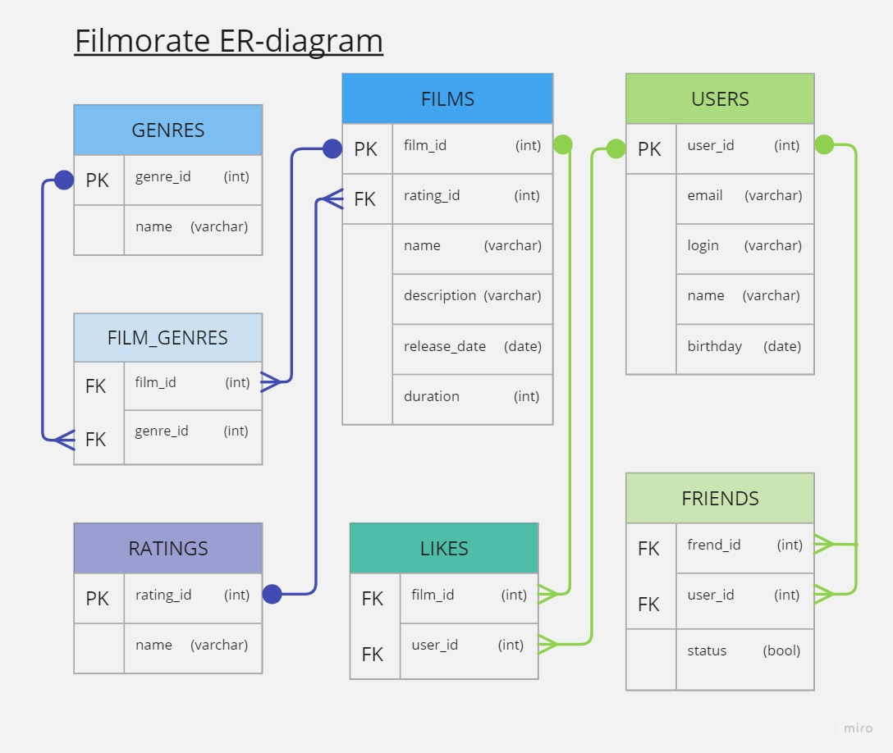

# Spring Boot приложение Filmorate (от англ. film — «фильм» и rate — «оценивать»).

## Спринт 9

 
 ТЗ 

В репозитории создайте ветку: controllers-films-users. 
Разработку решения для первого спринта нужно вести в ней.
Создайте заготовку проекта с помощью Spring Initializr.

### Модели данных
Создайте пакет model. Добавьте в него два класса — Film и User. Это классы — модели данных приложения.  
У model.Film должны быть следующие свойства:
- целочисленный идентификатор — id;
- название — name;
- описание — description;
- дата релиза — releaseDate;
- продолжительность фильма — duration.

Свойства model.User:
- целочисленный идентификатор — id;
- электронная почта — email;
- логин пользователя — login;
- имя для отображения — name;
- дата рождения — birthday.
-
### Хранение данных
Сейчас данные можно хранить в памяти приложения.
Для этого используйте контроллер.

### REST-контроллеры
Создайте два класса-контроллера. FilmController будет обслуживать фильмы, а UserController — пользователей.
Убедитесь, что созданные контроллеры соответствуют правилам REST.  
Добавьте в классы-контроллеры эндпоинты с подходящим типом запроса для каждого из случаев.

Для FilmController:
- добавление фильма;
- обновление фильма;
- получение всех фильмов.

Для UserController:
- создание пользователя;
- обновление пользователя;
- получение списка всех пользователей.

Эндпоинты для создания и обновления данных должны также вернуть созданную или изменённую сущность.

### Валидация
Проверьте данные, которые приходят в запросе на добавление нового фильма или пользователя. Эти данные должны соответствовать определённым критериям.   
Для Film:
- название не может быть пустым;
- максимальная длина описания — 200 символов;
- дата релиза — не раньше 28 декабря 1895 года;
- продолжительность фильма должна быть положительной.

Для User:
- электронная почта не может быть пустой и должна содержать символ @;
- логин не может быть пустым и содержать пробелы;
- имя для отображения может быть пустым — в таком случае будет использован логин;
- дата рождения не может быть в будущем.

### Логирование
Добавьте логирование для операций, которые изменяют сущности — добавляют и обновляют их.
Также логируйте причины ошибок — например, если валидация не пройдена.

### Тестирование
Добавьте тесты для валидации. Убедитесь, что она работает на граничных условиях.

## Спринт 10

 
 ТЗ 
  

### Наводим порядок в репозитории
Для начала убедитесь в том, что ваша работа за предыдущий спринт слита с главной веткой main.
Создайте новую ветку, которая будет называться add-friends-likes.

### Архитектура
Начнём с переработки архитектуры. Сейчас вся логика приложения спрятана в контроллерах — изменим это.
Вынесите хранение данных о фильмах и пользователях в отдельные классы.
Назовём их «хранилищами» (англ. storage) — так будет сразу понятно, что они делают.
- Создайте интерфейсы FilmStorage и UserStorage, в которых будут определены методы добавления, удаления и модификации объектов.
- Создайте классы InMemoryFilmStorage и InMemoryUserStorage, имплементирующие новые интерфейсы, и перенесите туда всю логику хранения, обновления и поиска объектов.
- Добавьте к InMemoryFilmStorage и InMemoryUserStorage аннотацию @Component, чтобы впоследствии пользоваться внедрением зависимостей и передавать хранилища сервисам.

### Новая логика
Пока у приложения нет никакой бизнес-логики, кроме валидации сущностей.
Обеспечим возможность пользователям добавлять друг друга в друзья и ставить фильмам лайки.
- Создайте UserService, который будет отвечать за такие операции с пользователями, как добавление в друзья, удаление из друзей, вывод списка общих друзей.
  Пока пользователям не надо одобрять заявки в друзья — добавляем сразу.
  То есть если Лена стала другом Саши, то это значит, что Саша теперь друг Лены.
- Создайте FilmService, который будет отвечать за операции с фильмами, — добавление и удаление лайка, вывод 10 наиболее популярных фильмов по количеству лайков.
  Пусть пока каждый пользователь может поставить лайк фильму только один раз.
- Добавьте к ним аннотацию @Service — тогда к ним можно будет получить доступ из контроллера.

### Зависимости
Переделайте код в контроллерах, сервисах и хранилищах под использование внедрения зависимостей.
- Используйте аннотации @Service, @Component, @Autowired. Внедряйте зависимости через конструкторы классов.
- Классы-сервисы должны иметь доступ к классам-хранилищам.
  Убедитесь, что сервисы зависят от интерфейсов классов-хранилищ, а не их реализаций.
  Таким образом в будущем будет проще добавлять и использовать новые реализации с другим типом хранения данных.
- Сервисы должны быть внедрены в соответствующие контроллеры.

### Полный REST
Дальше стоит заняться контроллерами и довести API до соответствия REST.
- С помощью аннотации @PathVariable добавьте возможность получать каждый фильм и данные о пользователях по их уникальному идентификатору:
  GET .../users/{id}.
- Добавьте методы, позволяющие пользователям добавлять друг друга в друзья, получать список общих друзей и лайкать фильмы.
  Проверьте, что все они работают корректно.
    - PUT /users/{id}/friends/{friendId} — добавление в друзья.
    - DELETE /users/{id}/friends/{friendId} — удаление из друзей.
    - GET /users/{id}/friends — возвращаем список пользователей, являющихся его друзьями.
    - GET /users/{id}/friends/common/{otherId} — список друзей, общих с другим пользователем.
    - PUT /films/{id}/like/{userId} — пользователь ставит лайк фильму.
    - DELETE /films/{id}/like/{userId} — пользователь удаляет лайк.
    - GET /films/popular?count={count} — возвращает список из первых count фильмов по количеству лайков.
      Если значение параметра count не задано, верните первые 10.
- Убедитесь, что ваше приложение возвращает корректные HTTP-коды.
    - 400 — если ошибка валидации: ValidationException;
    - 404 — для всех ситуаций, если искомый объект не найден;
    - 500 — если возникло исключение.

### Тестирование
Убедитесь, что приложение работает, — протестируйте его с помощью Postman: postman.json.

## Спринт 11 (Промежуточное задание месяца SQL)

 
 ТЗ 
  

### Задание для взаимопроверки
В этом задании вы будете проектировать базу данных для проекта, основываясь на уже существующей функциональности.
Вносить какие-либо изменения в код не потребуется.  
Готовое решение отправьте своему партнёру по взаимопроверке из группы.

### Загрузите решение
Начните с загрузки файла с решением в ваш репозиторий на GitHub.

### Доработка модели
Прежде чем приступить к созданию схемы базы данных, нужно доработать модель приложения.
Сейчас сущности, с которыми работает Filmorate, имеют недостаточно полей, чтобы получилось создать полноценную базу.
Исправим это!

#### Film
1. Добавьте новое свойство — «жанр». У фильма может быть сразу несколько жанров, а у поля — несколько значений. Например, таких:
- Комедия.
- Драма.
- Мультфильм.
- Триллер.
- Документальный.
- Боевик.

2. Ещё одно свойство — рейтинг Ассоциации кинокомпаний (англ. Motion Picture Association, сокращённо МРА). Эта оценка определяет возрастное ограничение для фильма. Значения могут быть следующими:
- G — у фильма нет возрастных ограничений,
- PG — детям рекомендуется смотреть фильм с родителями,
- PG-13 — детям до 13 лет просмотр не желателен,
- R — лицам до 17 лет просматривать фильм можно только в присутствии взрослого,
- NC-17 — лицам до 18 лет просмотр запрещён.

#### User
1. Добавьте статус для связи «дружба» между двумя пользователями:
2. неподтверждённая — когда один пользователь отправил запрос на добавление другого пользователя в друзья,
3. подтверждённая — когда второй пользователь согласился на добавление.

### Создание схемы базы данных
Начните с таблиц для хранения пользователей и фильмов. При проектировании помните о том, что:
- Каждый столбец таблицы должен содержать только одно значение. Хранить массивы значений или вложенные записи в столбцах нельзя.
- Все неключевые атрибуты должны однозначно определяться ключом.
- Все неключевые атрибуты должны зависеть только от первичного ключа, а не от других неключевых атрибутов.
- База данных должна поддерживать бизнес-логику, предусмотренную в приложении. Подумайте о том, как будет происходить получение всех фильмов, пользователей.
  А как — топ N наиболее популярных фильмов. Или список общих друзей с другим пользователем.

Теперь нарисуйте схему базы данных.

### Последние штрихи
Прежде чем отправлять получившуюся схему на проверку:
1. Скачайте диаграмму в виде картинки и добавьте в репозиторий. Убедитесь, что на изображении чётко виден текст.
2. Добавьте в файл README.md ссылку на файл диаграммы.
   Если использовать разметку markdown, то схему будет видно непосредственно в README.md.
3. Там же напишите небольшое пояснение к схеме: приложите примеры запросов для основных операций вашего приложения.

  

 
 ER-DIAGRAM 
 

В таблицах FRIENDS, LIKES, FILM_GENRES первичные ключи
составные.

Примеры запросов:

1. Получение количества лайков у фильма с ID = 1:  
   SELECT film_id,  
   COUNT(user_id) AS all_likes  
   FROM likes  
   WHERE film_id = 1  
   GROUP BY film_id;

2. Получение наименования и описания фильма с ID = 1:  
   SELECT name AS film_name,  
   description AS film_description  
   FROM films  
   WHERE film_id = 1;

 
